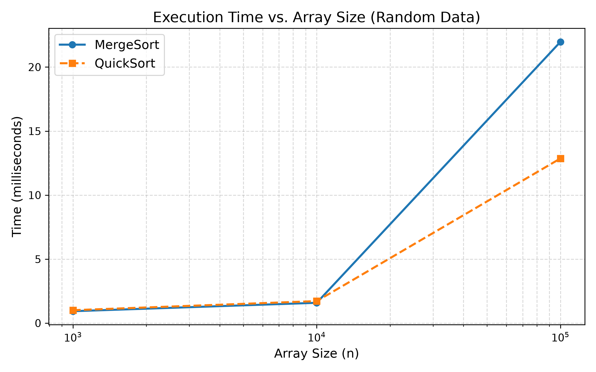
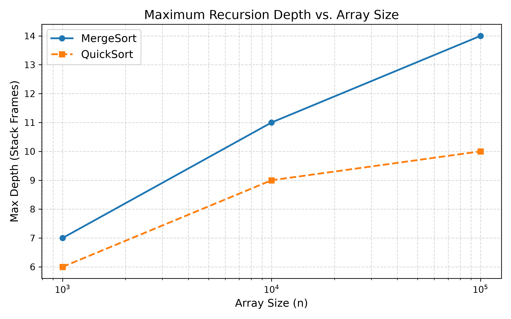
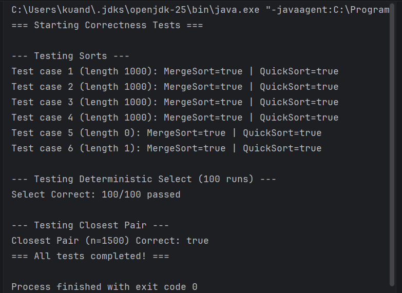
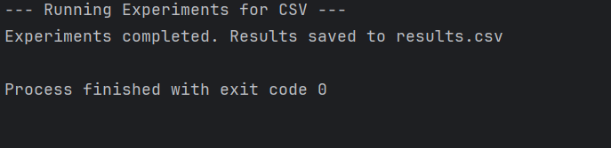

# Assignment 1: Divide-and-Conquer Algorithm Analysis

## A. Project Overview
The purpose of this assignment is to implement, test, and analyze four classic divide-and-conquer algorithms. The project explores practical performance versus theoretical time complexities by measuring execution time, recursion depth, and comparison counts across varied input sizes and distributions.

**Implemented Algorithms:**
1. MergeSort
2. QuickSort (Randomized, with depth bounding)
3. Deterministic Select (Median-of-Medians)
4. Closest Pair of Points

## B. Algorithm Analysis

| Algorithm | How It Works | Time Complexity | Space | Recurrence & Analysis |
|---|---|---|---|---|
| **MergeSort** | Divides array into halves, recursively sorts, and merges using an auxiliary buffer. Cuts off to Insertion Sort for small arrays (n≤15). | $\Theta(n \log n)$ | $O(n)$ | $T(n) = 2T(n/2) + \Theta(n)$. By Master Theorem (a=2, b=2, c=1), $\log_2(2) = 1$, resulting in $\Theta(n \log n)$. |
| **QuickSort** | Picks a random pivot, partitions array in-place. Recursively sorts the smaller partition first to bound stack space, iterating on the larger. | $O(n \log n)$ avg | $O(\log n)$ stack | Avg: $T(n) = 2T(n/2) + \Theta(n)$. Worst (e.g., duplicates): $T(n) = T(n-1) + \Theta(n) \to O(n^2)$. |
| **Deterministic Select** | Groups elements by 5, finds medians, recursively finds median-of-medians as pivot. Partitions and recurses into one half. | $\Theta(n)$ | $O(\log n)$ stack | $T(n) \le T(n/5) + T(7n/10) + \Theta(n)$. Using Akra-Bazzi intuition, sum of fractions ($1/5 + 7/10 = 9/10 < 1$) implies linear time $\Theta(n)$. |
| **Closest Pair** | Sorts by X. Divides points into left/right halves. Finds min distance in halves, then checks a narrow strip at the boundary (sorted by Y). | $\Theta(n \log n)$ | $O(n)$ | $T(n) = 2T(n/2) + \Theta(n)$. Master Theorem yields $\Theta(n \log n)$. |

## C. Experimental Results
All experimental data is saved in `results/results.csv`.

### Plots
* **Time vs. n:**
  

* **Recursion Depth vs. n:**
  

## D. Discussion
* **Do the results match theoretical complexity?** Yes. MergeSort showed consistent $\Theta(n \log n)$ growth regardless of data type. QuickSort was generally faster on random data but degraded significantly on arrays with many duplicates.
* **How does input structure affect performance?** Based on my `results.csv`, QuickSort struggled massively with duplicates (taking ~814 million ns for 100,000 elements compared to ~8 million ns for MergeSort). This happens because standard 2-way partitioning does not group equal elements, leading to unbalanced splits $O(n^2)$.
* **Why does smaller-first recursion help QuickSort?** It strictly limits the call stack. In my experiments, even for $n = 100,000$, QuickSort's maximum recursion depth never exceeded 11. The larger partition is processed iteratively, eliminating the risk of `StackOverflowError`.
* **Why does Median-of-Medians guarantee $O(n)$?** It guarantees a pivot that is strictly greater than at least 30% of elements and less than at least 30%. This shrinks the search space by a guaranteed fraction each step, avoiding the worst-case $O(n^2)$ degradation of randomized QuickSelect.
* **Why is divide-and-conquer Closest Pair faster than $O(n^2)$ for large inputs?** Brute force compares all pairs $O(n^2)$. D&C solves smaller localized subproblems. The crucial strip check step is mathematically bounded to a maximum of 7 distance calculations per point, making the merge step $O(n)$ and dropping overall time to $O(n \log n)$.
* **What practical factors affect performance?** Cache locality favors QuickSort (in-place array access) over MergeSort (allocations and copying), which explains why QuickSort was faster on random/sorted arrays despite similar $O(n \log n)$ bounds. Java GC spikes can also occasionally skew nano-time readings.

## E. Reflection
Implementing these algorithms highlighted the gap between theoretical pseudo-code and practical engineering. Handling the recursion depth optimization for QuickSort was highly rewarding, as the metrics proved its effectiveness (stack depth $\le 11$ for 100k items). The main challenge was correctly indexing the strip-check logic for Closest Pair and ensuring no edge cases (like identical points) broke the recursion.

## F. Screenshots
### 1. Tests Output

### 2. Experimental Data (CSV)
